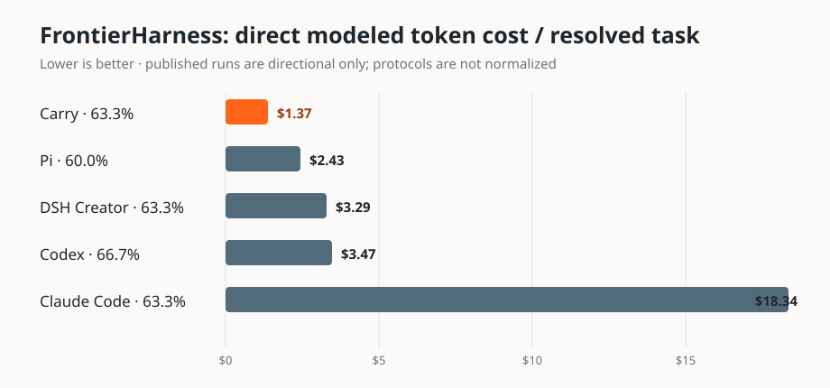

# Carry

Carry is an experimental coding agent built to reduce context cost without
throwing away the evidence needed to finish the job. It gives a model a shell,
records its work, and saves the resulting patch, trace, and usage record.

> **Safety:** use a disposable checkout. Carry's shell is **not** a security
> boundary. Do not give it your home directory, secrets, credentials, or unrelated
> work.

## How Carry reduces cost

- **Model-directed context management.** Human-authored content is kept by
default. The model can protect evidence, mark stale tool output removable, or
save a concise learning from it. Model-protected items now receive keep leases by
default: after eight later model turns they become due for a batched review.
The model can renew protection; unrenewed items become eligible for compaction,
not immediately deleted. Configure the positive lease length with
`--keep-lease-turns N` or `CARRY_KEEP_LEASE_TURNS`. Human content remains kept by
default unless its retention is explicitly changed.
- **Cost-optimized compaction planning.** The default `economic` policy estimates
whether the next request becomes cheaper before rewriting context; otherwise it
keeps the existing history and its prompt-cache reuse.
- **Inspectable results.** Each session retains `final.patch`, `result.json`,
`trace.jsonl`, and shell output. The trace has no API headers or keys.

Carry is an experiment, not a claim that compaction is always useful. See the
[context-policy design](docs/context-policy.md) for the lifecycle and accounting
rules.

## Evidence at a glance

### Official SWE-bench Verified 50

Carry's latest fixed 50-task run used `gpt-5.6-luna`, medium reasoning, a
360-second task limit, `economic` compaction, and the five-request payoff horizon.
It resolved **41 / 50 (82%)** for **$0.576700** modeled model cost in **46m49s**.

| Harness | Resolved | Modeled model cost | Workflow wall time |
| --- | ---: | ---: | ---: |
| [Carry — current context policy](https://github.com/wiggzz/carry/actions/runs/34779347812) | 41 / 50 (82%) | $0.576700 | 46m49s |
| [Pi — prior fixed-catalog reference](https://github.com/wiggzz/carry/actions/runs/32549988183) | 36 / 50 (72%) | $0.661475 | 45m00s |
| [Codex — prior fixed-catalog reference](https://github.com/wiggzz/carry/actions/runs/32547842935) | 37 / 50 (74%) | $1.045054 | 46m38s |

Against the prior fixed-catalog references, Carry is **10 percentage points higher**
in resolved rate and **12.8% lower-cost** than Pi; against Codex, it is **8 points
higher** and **44.8% lower-cost**. These are single benchmark runs, so stochastic variance applies. They are useful
indicators of performance and modeled cost, not conclusive rankings.

### FrontierHarness 30

Carry resolved **19 / 30 (63.3%)** on a frozen Terminal-Bench + DataCurve mix,
with a **$25.9656411** direct modeled token-cost lower bound (**$1.3666 / pass**),
**5m51s** median recorded agent time, and **5h19m45s** workflow wall time. The
main run and its copy-only evidence recovery are
[artifact-gated](docs/benchmark-results.md#frontierharness-30).



On this directional performance-versus-cost chart, Carry sits on the plotted
efficiency frontier: **63.3%** resolved at a **$1.3666** direct modeled token-cost
lower bound per pass. Versus the published Pi point, that is **5.5% higher pass
rate** (+3.3 points) and **43.8% lower cost/pass**. Versus Codex, Carry is
**60.6% lower cost/pass** but **5.1% lower** in pass rate (−3.4 points). **It is
directional, not a head-to-head claim:** task IDs partly overlap, but agent/model
versions, evaluator/runtime/egress policy, timeouts, and verifier semantics are
not normalized.

Read [benchmark evidence](docs/benchmark-results.md) for immutable run links,
configuration, accounting, recovery provenance, and limitations. One run is
useful evidence, not a general quality ranking.

## Install and try it

### Install a release

Download the Linux x86_64 archive and `SHA256SUMS` from the
[latest release](https://github.com/wiggzz/carry/releases/latest), then verify
before installing:

```sh
sha256sum -c SHA256SUMS
mkdir -p ~/.local/bin
tar -xzf carry-<version>-x86_64-unknown-linux-gnu.tar.gz
install -m 0755 carry ~/.local/bin/carry
carry --help
```

### Build from source

```sh
git clone https://github.com/wiggzz/carry.git
cd carry
cargo build --release --locked
./target/release/carry --help
```

### Run an isolated task

Set an API key in the process environment and point Carry at a disposable
checkout:

```sh
export OPENAI_API_KEY=...
carry --cwd /path/to/disposable/repo fix the failing tests
```

An eligible ChatGPT subscription can use the Codex endpoint instead:

```sh
carry login
# headless host:
carry login --device-auth
```

`OPENAI_API_KEY` takes precedence and is required for a custom
`OPENAI_BASE_URL`. Remove the stored subscription credential with `carry logout`.
Use `-p` when the prompt begins with an option-like value.

Run without a prompt to start the localhost-only HTML UI and open it in your
default browser. Use `--no-open` on remote/headless machines or to open the printed
URL yourself. Browser-launch failures do not stop the server.
`--serve` remains an explicit alias. Use `--interactive` for terminal follow-ups
and steering. Supplying a prompt still runs once in the terminal; use `--print`
to explicitly select one-shot mode, including when piping a prompt from stdin:

```sh
carry --cwd ../project
carry --port 9000
carry --interactive -p "investigate the flaky test"
printf 'explain the failing tests' | carry --print
```

### Terminal input and formatting

In `--interactive` mode, Enter sends the draft. Alt+Enter or Ctrl+J inserts a
newline; Shift+Enter also works when the terminal reports it distinctly. Pasted
blocks are inserted without submitting (bracketed paste), preserving indentation
and blank lines. Arrow keys edit the draft, including earlier lines. Ctrl+C clears
the draft; Ctrl+D on empty input or `/quit` exits. `/help` lists commands. The old
`/paste` and `/end` commands remain available for compatibility.

The editor stays in the normal terminal screen. Status output is printed above
the editable draft. While the editor is active, streamed answers are buffered to
complete lines (the last partial line is flushed on completion) to avoid disruptive
per-token redraws. Terminal shell commands are shown once when execution starts,
not repeatedly while their arguments are being generated; the browser still shows
live shell-call previews. On Unix, run `cargo build && python3 tests/terminal_editor.py`
for the editor’s pseudo-terminal smoke tests.

Answers use lightweight terminal Markdown styling: colored headings, bold text,
inline/fenced code, and muted block quotes. Lists, links, and tables remain readable
Markdown source; code is colored as a block, not syntax-highlighted. Redirected
stdout, `NO_COLOR`, and `TERM=dumb` preserve the original Markdown without styling.
Output stays in native terminal scrollback, without a live token-counter redraw.
Your terminal's “scroll on output” setting controls whether new output scrolls
you back down.

Model answer/commentary text is previewed as it streams, in both the browser
and a terminal (on stderr when it is a TTY). Previews are provisional; completed
answers are rendered as Markdown. A fully streamed terminal answer is not printed a second time at completion.
If streaming was incomplete or stdout is redirected, the complete answer is still
printed; redirected stdout remains suitable for piping. Tool arguments and context bookkeeping are not displayed
as raw JSON. Private reasoning is not shown.

Each model response in the browser includes its own input, cached-input, output,
and total token counts. The footer shows only estimated session cost in USD, using the repository’s
benchmark rates (currently available for `gpt-5.6-luna`). This is not a billing
quote. Missing pricing or older responses without cost metadata show compact token totals instead
(e.g. `2.5m tokens (2.4m cached, 120k out)`), rather than an incomplete cost.

In the browser, submitted messages stay beside the composer as “sending”, then
“queued” once accepted. They move into the conversation when added to the model's
context, rather than appearing among output before they have been consumed.
Steering received during a finishing response starts another turn automatically.

## Inspect a run

Sessions live under `$CARRY_HOME/sessions` (or `~/.carry/sessions`). Continue a
session by ID or path while writing the continuation elsewhere:

```sh
carry --resume 20260827-123456-abcdef --session-home /path/to/carry-home -p "continue"
carry --resume /path/to/prior-session --session-dir /path/to/fresh-output -p "new task"
```

Each session includes:

- `context-state.json` — atomically updated canonical context checkpoint
- `final.patch` — the agent's resulting patch
- `result.json` — outcome, usage, cost estimate, retries, and compactions
- `trace.jsonl` and shell-output files — chronological execution evidence

The default model is `gpt-5.6-luna`; choose another with `--model` or
`OPENAI_MODEL`. There is no default step limit; use `--max-steps N` only when a
specific cap is required.

## Development

```sh
cargo fmt -- --check
cargo clippy --all-targets -- -D warnings
cargo test
cargo build --release --locked
```

The deterministic fixture smoke needs Docker but no model credential:

```sh
docker build --tag carry:dev .
./scripts/run-fixture.sh clamp scripted
```

Live fixtures require `OPENAI_API_KEY`; Codex fixture comparisons also need a
configured Codex CLI session. Neither runs in CI.

## Maintainer operations

The protected SWE-bench workflow is for maintainers. Read
[benchmark isolation](docs/benchmark-isolation.md) and the
[workflow](.github/workflows/run-swebench.yml) before dispatching it. Every
model-bearing official run uses disposable containers, a model-key-only agent
environment, credential-free grading, immutable task images, and exact cleanup
checks.

Contributions use Conventional Commit titles. CI runs formatting, Clippy, unit
tests, a release build, and the scripted fixture. Release Please publishes the
Linux x86_64 archive and checksum after its release PR merges.
